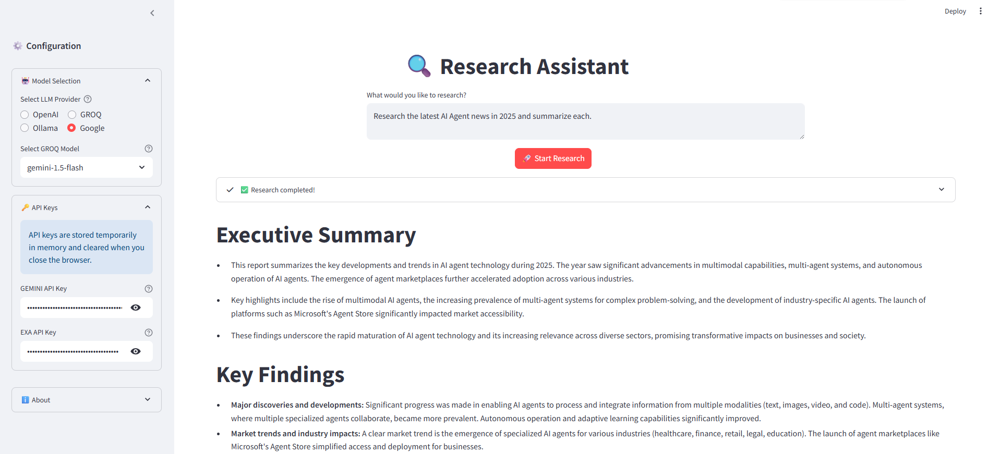

# 🔍 Research Assistant Using CrewAI
- A powerful research assistant built with CrewAI, Exa, and Streamlit that helps you research any topic using AI Agents.



---

# 🌟 Features

- 🤖 Multiple LLM Support
- 🔍 Advanced answering capabilities using Exa
- 📊 Real-time research process visualization
- 📝 Structured research reports
- 🎯 Topic-focused research and analysis
- 🔒 Secure API key management
- 📱 Responsive and modern UI

---

# ⚙️ Installing Dependencies

### Create Virtual Python-3.12 Environment
```bash
uv venv --python 3.12
```

### Activating the Virtual Environment 

- macOS/Linux
```bash
source .venv/bin/activate
```

- Windows (PowerShell)

```bash
.venv\Scripts\Activate
```
---


### Single Packages
```bash
uv pip install <package_name>
```

### From a requirements.txt File
```bash
uv pip install -r requirements.txt
```
---

### To recreate your environment elsewhere (e.g. on CI or another machine), install exactly what’s in the lockfile:

```bash
uv sync
```
---

### To capture the exact versions of all installed packages, generate a lockfile:
```bash
uv lock
```

--- 

# 📄 License

This project is licensed under the MIT License - see the LICENSE file for details.

---

# 🙏 Acknowledgments

- [CrewAI](https://crewai.com) for the AI agent framework
- [Exa](https://exa.ai) for advanced search capabilities
- [Streamlit](https://streamlit.io) for the web interface

---

Made by Dhruv Saxena using CrewAI, Exa, and Streamlit
